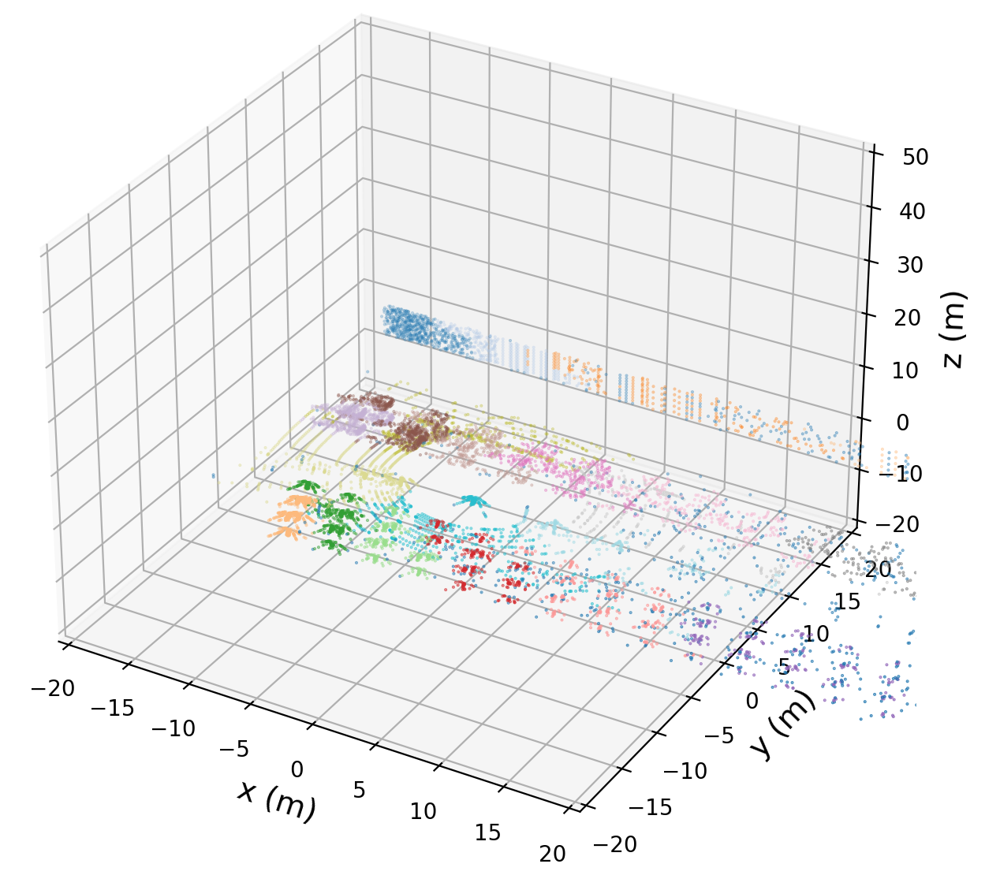
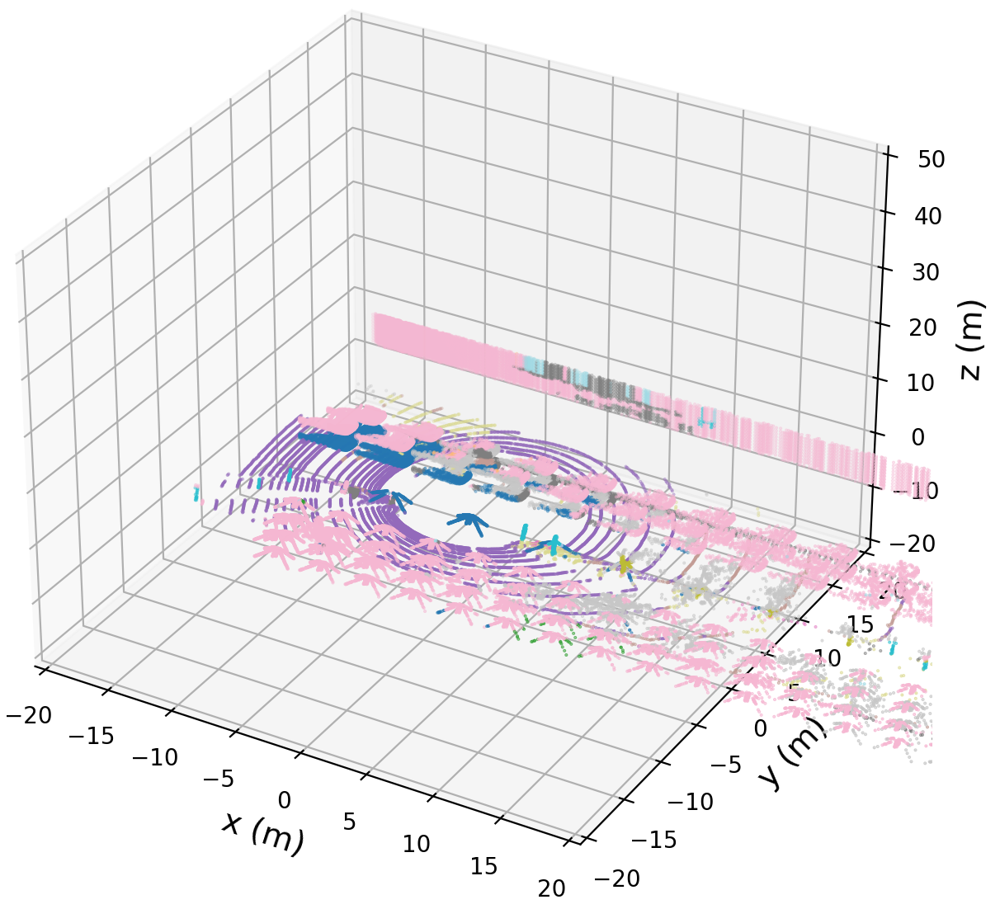
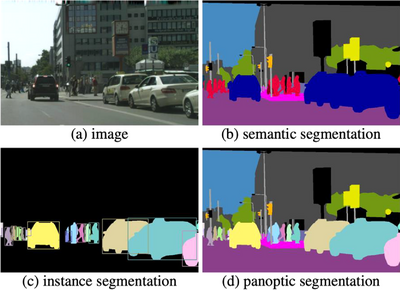

# Introduction

This repository implements the unsupervised [KD-Tree](https://en.wikipedia.org/wiki/K-d_tree) [DBSCAN](https://en.wikipedia.org/wiki/DBSCAN) clustering LiDAR point cloud instance segmentation algorithm from scratch. Except for DBSCAN, we could use the following algorithms as well. DBSCAN is a clustering-based algorithm. According to [Comparing Different Sklearn Clustering Algorithms On Toy Datasets](https://scikit-learn.org/stable/auto_examples/cluster/plot_cluster_comparison.html), DBSCAN is one of the best algorithms. Other reasons we selected DBSCAN are:

* Cluster discovery: DBSCAN can find clusters of any shape and size, including non-linear shapes.
* Noise identification: DBSCAN can identify noise data while clustering.
* Cluster density separation: DBSCAN is good at separating high-density clusters from low-density clusters.
* Cluster number specification: DBSCAN doesn't require the number of clusters to be specified in advance.

| Algorithm                        | Advantages                                                                 | Disadvantages                                                              |
|----------------------------------|---------------------------------------------------------------------------|---------------------------------------------------------------------------|
| Deep Learning-Based Segmentation | Can learn complex patterns and features in point clouds                   | Requires a large amount of labeled data for training                     |
|                                  | Highly accurate and can handle noisy data                                 | Can be computationally expensive and require powerful hardware           |
| Clustering-Based Segmentation    | Simple and easy to implement                                              | May struggle with complex geometries and irregular shapes                |
|                                  | Efficient for finding clusters in dense point clouds                      | Sensitivity to hyperparameters and starting conditions                    |
| Region Growing-Based Segmentation| Can handle noise and outliers effectively                                 | May be sensitive to initial seed points and parameters                    |
|                                  | Robust to varying densities and shapes                                    | Can be computationally expensive for large point clouds                   |
| Supervoxel-Based Segmentation    | Can effectively group points into compact and homogeneous regions         | May struggle with separating instances with overlapping supervoxels       |
|                                  | Can provide more meaningful representation of point clouds                | Sensitivity to supervoxel size and parameters                             |
| Graph-Based Segmentation         | Can capture relationships between points and model complex structures     | Computational complexity and memory requirements for constructing graphs  |
|                                  | Flexible and adaptable to different types of point cloud data             | Difficulty in defining edge weights and graph construction                |

# How to Use

1. Install with Python 3.7+:

```
python -m venv .venv
source .venv/bin/activate
pip install -r requirements.txt
```

3. Run:

```
python implementation.py
```

Output:



# Limitations and Potential Improvements

Currently, we haven't detected the cluster class (such as person, car, etc.). Compared to sklearn's DBSCAN, the current implemented DBSCAN is slower. Potential ways to improve are: 1) to use depth only for DBSCAN to speed up; 2) use Ball Tree.

# Evaluation

Since we don't have ground truth, we used sklearn HDBSCAN output as the ground truth to calculate our implementation's following [Clustering Performance Evaluation Metrics](https://scikit-learn.org/stable/modules/clustering.html#clustering-performance-evaluation):

```
V-measure: 0.694
Adjusted Rand Index: 0.094
Adjusted Mutual Information: 0.477
Silhouette Coefficient: -0.060
```

# Potential Future Work

* Detect the 3d object classes (such as a person, car, etc)
* Ignore ground
* Evaluate the algorithm with mIoU, Panoptic Quality (PQ), and Segmentation Quality
(SQ) with the better pseudo instance segmentation ground truth generated by the pre-trained Cylinder3D model.

# Extra: Generate Pseudo Semantic Segmentation Ground Truth by Pre-trained Cylinder3D Model

The SOTA 3D instance segmentation algorithms are based on deep learning. We could use the pre-trained deep learning model to generate better pseudo ground truth by a SOTA pre-trained model. For 3D instance and panoptic segmentation, there are mainly two types of application scenarios:

* Indoor Scene Understanding: ScanNet is one of the popular benchmark datasets and PointNet++ is one of the SOTA models.
* Outdoor Driving: SemanticKITTI is one of the popular benchmark datasets and Cylinder3D is one of the SOTA outdoor point cloud panoptic segmentation models.

We use Cylinder3D in MMDetection3D to generate the pseudo ground truth:

1. Convert the original `[[x1,y1,z1], [x2,y2,z2], ...]` [pointcloud_data.npy](./data/pointcloud_data.npy) to SematicKITTI's `[[x1,y1,z1,intensity1], [x2,y2,z2,intensity2], ...]` binary format [pointcloud_data.bin](./data/pointcloud_data.bin):

```
python ./tools/export_xyz_to_bin.py
```

2. [Install MMDetection3D](https://mmdetection3d.readthedocs.io/en/latest/get_started.html)
3. Download the [pre-trained Cylinder3D model and config](https://github.com/open-mmlab/mmdetection3d/tree/main/configs/cylinder3d)
```
# switch to the mmdetection3d repository folder after the installation
cd ../mmdetection3d

wget https://download.openmmlab.com/mmdetection3d/v1.1.0_models/cylinder3d/cylinder3d_8xb2-amp-laser-polar-mix-3x_semantickitti_20230425_144950-372cdf69.pth
```

4. [Infer 3D Semantic Segmentation](https://mmdetection3d.readthedocs.io/en/latest/user_guides/inference.html#d-segmentation) (Currently, MMDetection3D Cylinder3D only supports Semantic Segmentation)

```
python demo/pcd_seg_demo.py pointcloud_data_4d_downsample1.bin cylinder3d_8xb2-laser-polar-mix-3x_semantickitti.py cylinder3d_8xb2-amp-laser-polar-mix-3x_semantickitti_20230425_144950-372cdf69.pth --out-dir outputs

# you can find the output at outputs/preds/pointcloud_data_4d_downsample1.json
```

Cylinder3D Semantic Segmentation Output:




# Appendix

Comparison of Semantic Segmentation, Instance Segmentation, and Panoptic Segmentation:



| Task                | Definition                                         | Example                                                |
|---------------------|----------------------------------------------------|--------------------------------------------------------|
| Semantic Segmentation | Divides an image into segments based on categories or classes (without differentiate each instance) | Separating pixels that belong to different objects/classes in an image |
| Instance Segmentation | Identifies individual objects within an image and assigns unique labels to each object (ignoring other objects and background). | Distinguishing between different instances of the same object in an image |
| Panoptic Segmentation | Combines semantic segmentation and instance segmentation to provide a holistic understanding of an image (segmenting all pixels and putting into different categories including backgrounds). | Provides both semantic segmentation for scene understanding and instance segmentation for object-level understanding in an image |

# References

* [MMDetection3D](https://github.com/open-mmlab/mmdetection3d)
* [Clustering Performance Evaluation](https://scikit-learn.org/stable/modules/clustering.html#clustering-performance-evaluation)
* [Comparing Different Sklearn Clustering Algorithms On Toy Datasets](https://scikit-learn.org/stable/auto_examples/cluster/plot_cluster_comparison.html)
* [Difference Between Panoptic Segmentation, Semantic Segmentation, and Instance Segmentation](https://www.researchgate.net/figure/Difference-between-panoptic-segmentation-semantic-segmentation-and-instance_fig2_371788447)
